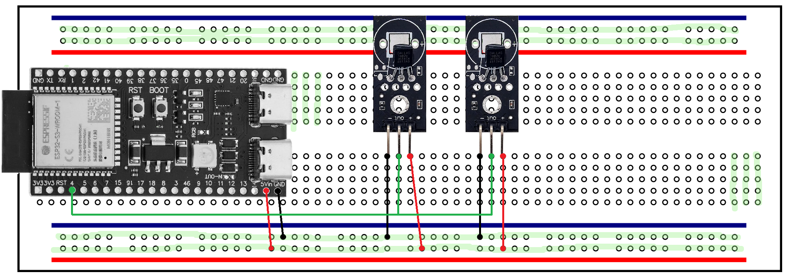

# OPCUA PubSub over MQTT

This example shows how to connect 1-Wire temperature sensors to ESP32 microcontroller, read temperature and publish values with OPCUA PubSub

## Connecting sensors

On the following image 1-wire sensors DS18B20 are connected in active mode. 1-wire network periodically scanned. Temperature from all discovered sensors periodically is reading.

## OPCUA Server with PubSub

[PubSub OPCUA server](.lua/opcua_server_mqtt.lua) is started on device with publishing values of changed nodes.
OPCUA Clients can connect to devices, browse address space and listen for value changes.

I this example temperature reads from devices and wites to OPCUA server nodes. OPCUA server is responsible for
publishing of changed values.

## Direct MQTT publishing

[MQTT publishing](.lua/mqtt_publish.lua) example shows how to use OPCUA PubSub client and publish changes directly to a MQTT broker.
In this example OPCUA server is not started and thus not possible to connect to device with
usual OPCUA clients. It is possible only to subscribe on MQTT changes from broker.

In this example temperature values read from sensors, values are set for publishing. OPCUA MQTT client encodes messages and
publish to MQTT broker.
