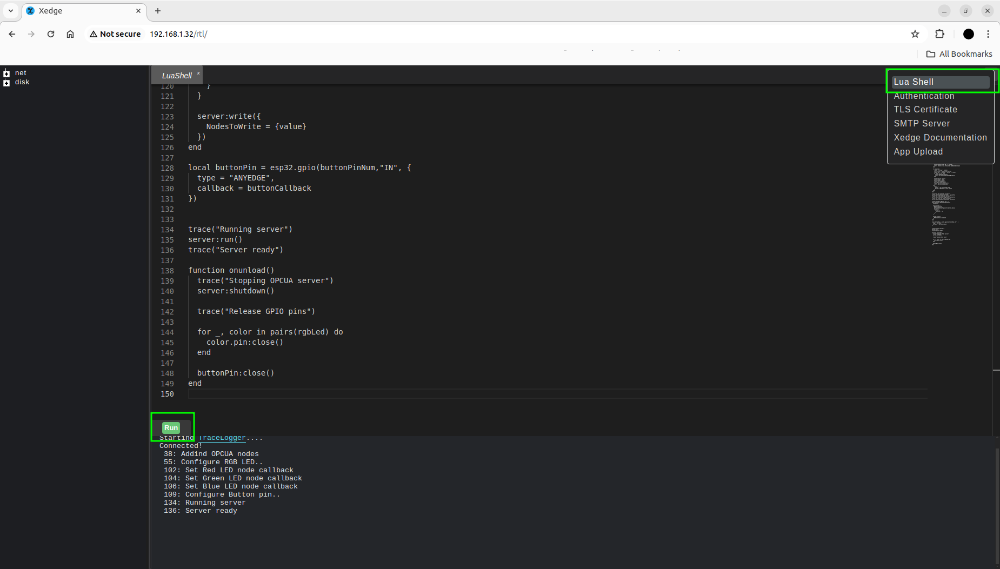

# ESP32 Project

- [Installation](#installation)
- [Ignition SCADA Visualization](#ignition-scada-visualization)

## Installation

This simple Xedge32 application implements a simple OPCUA server that can control RGB LED and expose button state into a Adddress Space.

On the picture you can see how to connect LED and Button:

First of all need to connect to connect to Xedge32 running on ESP32, start LUA shell and paste source code from file [opc-led-button-server.xlua](opc-led-button-server.xlua)

After running the script OPCUA server starts to listen on port 4841.
To connect to OPCUA server from any client by endpoint URL `opc.tcp://hostname:4841`

## Ignition SCADA Visualization

There is a visualication project in the folder `ignition`.
You can visually control hardware through Ignition Visualization.

To setup project you'll need to perform thefollowing steps:

- Add an OPCUA server to the Ignition server.
- Select the tags: Red, Green, Blue, Button, and create a new polled group for them.
- Import the visualization project [led_and_button_ignition.zip](ignition-led-and-button.zip).
- Import images using Image Management from [ignition-led-and-button-images](./ignition-led-and-button-images) folder.
- Run the project.

After running the project you can turn on and turn off the LED by on corresponging image. To see changes of button you need to press on hardware button.

