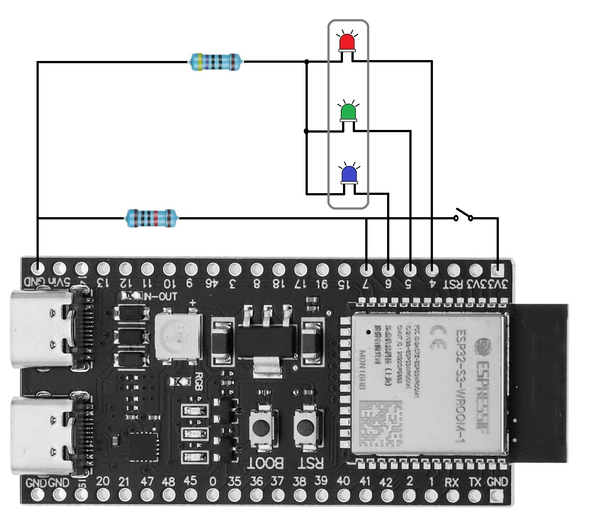
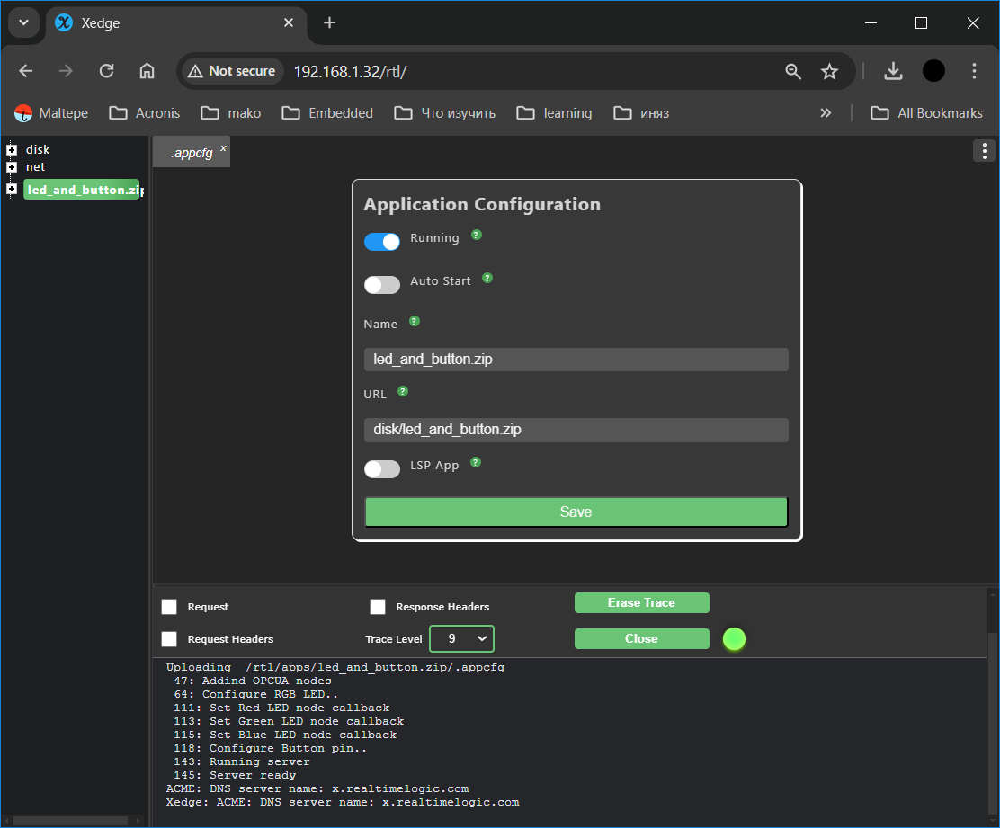
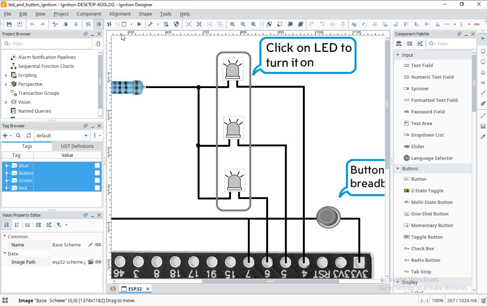

# ESP32 Project

- [Installation](#installation)
- [Ignition SCADA Visualization](#ignition-scada-visualization)

## Installation

This simple Xedge32 application implements a simple OPCUA server that can control RGB LED and expose button state into a Adddress Space.

On the picture you can see how to connect LED and Button:

First of all need to create an application package with `make` command:
On windows you can just create zip archive from `led_and_button` folder.

After this upload applicatio archive `led_and_button.zip` to Xedge32 and run it. When application is running OPCUA server starts to listen on port 4841.
To connect to OPCUA server from any client by endpoint URL `opc.tcp://hostname:4841`

## Ignition SCADA Visualization

There is a visualication project in the folder `ignition`.
You can visually control hardware through Ignition Visualization.

To setup project you'll need to perform thefollowing steps:

- Add an OPCUA server to the Ignition server.
- Select the tags: Red, Green, Blue, Button, and create a new polled group for them.
- Import the visualization project [led_and_button_ignition.zip](ignition/led_and_button_ignition.zip).
- Import images using Image Management from [ignition folder](./ignition).
- Run the project.

After running the project you can turn on and turn off the LED by on corresponging image. To see changes of button you need to press on hardware button.

