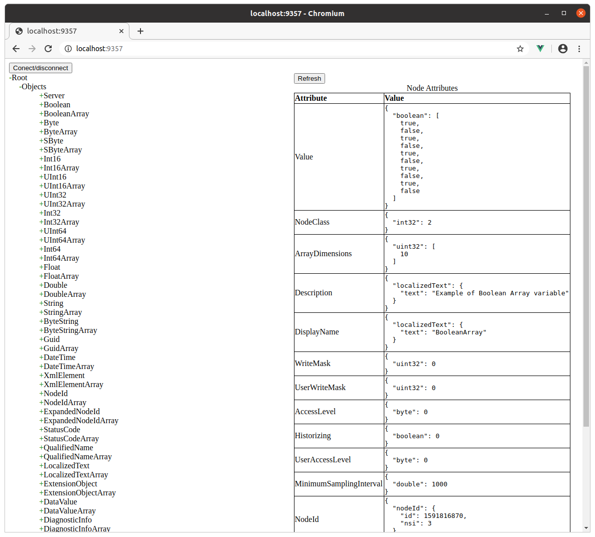

# OPC-UA Client and Web Client

This example includes a server side OPC-UA client and an OPC-UA
browser user interface. The OPC-UA browser user interface is
implemented as a HTML and JavaScript powered Single Page Application
(SPA). The SPA runs in the browser and communicates with the server
side OPC-UA client using WebSockets.

The HTML user interface enables you to connect to any OPC UA
server. Two applications are automatically loaded when you start the
Mako Server in this directory, the OPC-UA client and the OPC-UA server
found in the [../servers/server](../servers/server) directory. The
server example lets you quickly test the OPC UA client without having
to start any third party OPC UA server.

You may also connect other (external) OPC-UA clients to the server
example. See the
[OPC-UA client to server tutorial](https://realtimelogic.com/ba/opcua/thirdparty_clients.html)
in the OPC-UA main documentation for how to connect various OPC-UA
clients.

## Run the example as follows:

1. Open a command window in this directory
2. Start the Mako Server without providing any arguments and the Mako Server will load both the client and the server example. See the provided mako.conf for details. The mako.conf file also shows how the Mako server configuration file can be used for setting custom OPC-UA settings.
3. Open a browser window and navigate to http://localhost:portno, where portno is the port number the Mako Server is listening on.
4. Click the "Connect to endpoint" button to connect to the OPC Server loaded by the Mako Server
5. Click the plus (+) symbol in the browser to expand the root node.

The web page should look similar to the following after expanding the Root -> Objects nodes:

